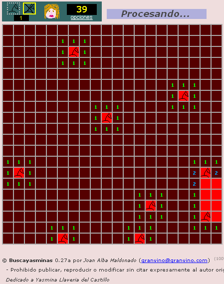

Buscayasminas 
============== 
by [Joan Alba Maldonado](https://joanalbamaldonado.com/) (joanalbamaldonadoNO_SPAM_PLEASE AT gmail DOT com, without NO_SPAM_PLEASE)

Minesweeper alike game totally written in DHTML.

Version: 0.30a 
- Date: 9th August 2006, last changes beyond 17th August 2006 (approximately).

You can donate at http://sourceforge.net/donate/index.php?group_id=174564

## Description

Open source Minesweeper game (configurable) totally written in DHTML (HTML, CSS and JavaScript).

It is my sixth DHTML game and was made in mid 2006.

Players can configure the game with some options. You can change the number of mines, board size and set a time limit (in seconds) or disable it.

You can also change the game behaviour easily by editing many of the configuration variables which are at the beginning of the script. To change the game images you just need to replace them with others.

Official languages are Spanish and English.

You can find other modified and adapted versions of this game on the Internet, including one Opera widget.

This game has been tested under BeOS, Linux, NetBSD, OpenBSD, FreeBSD, Windows, Mac OS X, BlackBerry Tablet OS, Android, iOS and others.

Play online in English: http://buscayasminas.tuxfamily.org/buscayasminas_english/

Play online in English (mirror): http://www.dhtmlgames.com/buscayasminas/buscayasminas_english/

Play online in Spanish: http://buscayasminas.tuxfamily.org/buscayasminas_spanish/

Play online in Spanish (mirror): http://www.dhtmlgames.com/buscayasminas/buscayasminas_spanish/

Official web site: http://buscayasminas.tuxfamily.org/ (mirror at http://www.dhtmlgames.com/buscayasminas/).

## License

This project can be used, reproduced, distributed and modified freely for any non-commercial purposes but always keeping the author's name and copyright clauses. Other than that, just use this project as you wish but never sell it!